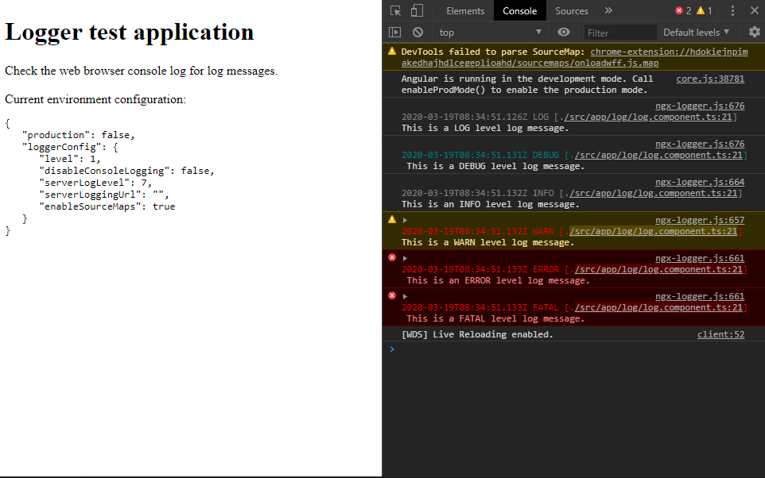

# Angular logging app

A sample Angular logging app that can log on the web browser console or via an HTTP POST endpoint using [ngx-logger](https://github.com/dbfannin/ngx-logger).

## Log message example
```
2020-03-19T08:34:51.133Z FATAL [./src/app/log/log.component.ts:21] This is a FATAL level log message.
```
## App screen



## Running

Run `ng serve` for a dev server. Navigate to `http://localhost:4200/`. The app will automatically reload if you change any of the source files. Add the `--prod` flag for production server.

## Development vs production server

The development server logs the messages in the web browser console and the production logs by posting to an HTTP enpoint. This endpoint is not implemented by this project, so a 404 error is expected.

## Implementation details

* The logger configuration for each enviroment can be found in the [environment/config](./src/environments/config) folder.
```
export const loggerConfig: LoggerConfig = {
    level: NgxLoggerLevel.DEBUG,
    disableConsoleLogging: false,
    serverLogLevel: NgxLoggerLevel.OFF,
    serverLoggingUrl: '',
    enableSourceMaps: true
}
```
* Be aware that the logging library only logs the correct file name and line if `sourceMap: true` and `optimization: false` in the [angualar.json](./angular.json) file. This could weaken the security and performance of the application.

* The NGXLogger injected by Angular dependency injection system is a singleton, so it's possible to inject HTTP headers during the initialization of the app and all other components will use the same configuration automatically. The headers were injected in the [app.component.ts](./src/app/app.component.ts) in the app.

* Having an Angular service wrapping the logging library would be great in case it's needed to change for another logging library, but the original file and line that invoked the logger would not be present in the log text.
